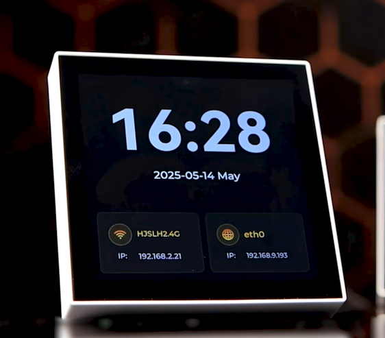

# Luckfox Pico LVGL example
[English](./README.md)
+ 本例程基于 lvgl-8.3 设计界面
+ 本例程基于 lv_driver-8.1 驱动显示设备和输入设备
+ 专为`Luckfox Pico 86Panel`系列提供的图形界面开发例程

## 支持平台
|型号|操作系统|分辨率|网络接口|
|------------------------|---------|-------|------------|
|Luckfox Pico 86 Panel   |Buildroot|720x720|以太网|
|Luckfox Pico 86 Panel W |BUildroot|720x720|以太网/Wi-Fi|

## 实现效果


## 界面介绍
+ **Time**：主界面显示时间日期，联网后自动同步
+ **Wi-Fi**：点击后进入配网配置，点击 `Scan` 扫网后输入Wi-Fi 的SSID和密码，在 Luckfox Pico 86 Panel 上该按键不响应
+ **Music**：主界面下滑进入音乐播放界面，仅支持 `.mp3` 格式，需要将播放的音乐文件放置到 `/music` 目录中
+ **Relay**：控制板载继电器


## Buildroot
### 编译
+ 设置环境变量
    ```
    export LUCKFOX_SDK_PATH=< luckfox-pico Sdk 地址 >
    ```
    **注意**：使用绝对地址。
+ 使用 CMake 编译获取可执行程序 
    ```
    mkdir build
    cd build
    cmake ..
    make -j
    ```

### 运行
+ 将编译生成的可执行程序 `86UI_Demo` 上传到板端(可使用adb ssh等方式)
+ 关闭默认运行的 `86UI_Demo` 程序
    ```
    killall 86UI_Demo
    ```
+ 板端设置可执行权限后执行
    ```
    chmod a+x 86UI_Demo
    ./86UI_Demo
    ```
+ 可出厂程序 `/usr/bin/86UI_Demo` 开机自启
